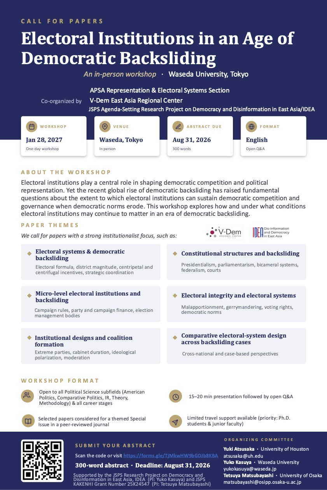

## Upcoming

**Representation and Electoral Systems Business Meeting (APSA 2026)**

September 3 (Thursday), 2026, 6:30 to 7:30pm\
Location: Marriott Copley Place\
Room: *Marriott, Clarendon*\
About: In this event, we will report several updates and future directions about this section.

**Joint Reception by Representation and Electoral Systems and Political Organizations and Parties (APSA 2026)**

September 4 (Friday), 2026, 7:30pm-9:00pm\
Boston Marriott Copley Place\
Room: Salon I\
About: In this event, we will host a joint reception. Food and beverages will be served.\

**Workshop: Electoral Institutions in an Age of Democratic Backsliding**

January 28 (Thursday), 2027\
Waseda University (Tokyo, Japan)\
CfP: Electoral institutions play a central role in shaping democratic competition and political representation. Yet the recent global rise of democratic backsliding has raised fundamental questions about the extent to which electoral institutions can sustain democratic competition and governance when democratic norms erode. This workshop explores how and under what conditions electoral institutions may continue to matter in an era of democratic backsliding. We welcome papers with a strong institutionalist focus, ranging from electoral systems and constitutional structures to campaign rules, electoral integrity, and coalition formation. \
\
The workshop is open to scholars in all subfields of political science and at all career stages. Presentations will be 15-20 minutes followed by an open Q&A, and the working language is English. Selected papers will be considered for a themed special issue in a peer-reviewed journal, and limited travel support is available, with priority given to Ph.D. students and junior faculty. To submit, please send a 300-word abstract by August 31, 2026 through this form: <https://forms.gle/TjMkwHW9bGDJb8KBA>\
\
Organizers: This event is co-organized by the APSA Representation & Electoral Systems Section, the V-Dem East Asia Regional Center, and the JSPS Agenda-Setting Research Project on Democracy and Disinformation in East Asia/IDEA.\
\

## Past events

*No past events are available to date.*
